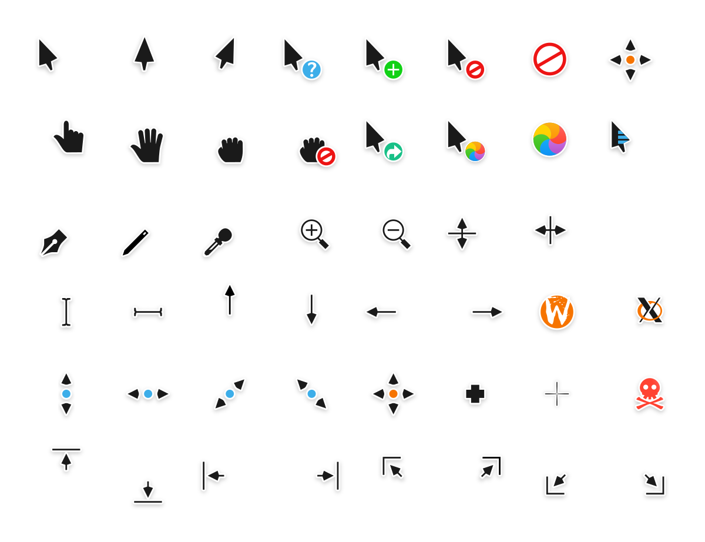
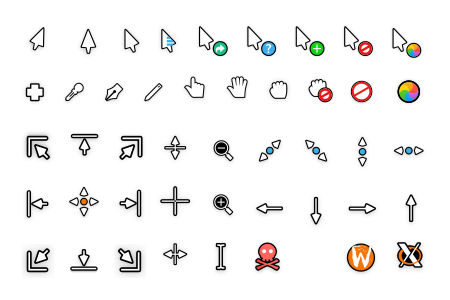

# Capitaine cursors

This is an x-cursor theme inspired by macOS and based on KDE Breeze.
The source files were made in Inkscape, and the theme was designed to pair well with my icon pack, [La Capitaine][la-capitaine-icons].

[la-capitaine-icons]: https://github.com/keeferrourke/la-capitaine-icon-theme

This cursor should scale appropriately for any display resolution.

## Supported DPIs

This cursor pack aims to support all [named pixel densities][named-dpi].

[named-dpi]: https://en.wikipedia.org/wiki/Pixel_density#Named_pixel_densities

| Name    | Build option name | Rendered density (DPI) | Scale          |
| :------ | :---------------- | :--------------------- | :------------- |
| LODPI   | `-d lo`           | 96-144                 | x1, 1.25, x1.5 |
| TVDPI   | `-d tv` (default) | 192                    | x2             |
| HDPI    | `-d hd`           | 240                    | x2.5           |
| XHDPI   | `-d xhd`          | 288                    | x3             |
| XXHDPI  | `-d xxhd`         | 384-480                | x4, x5         |
| XXXHDPI | `-d xxxhd`        | 576+                   | x6, x10        |

## Building from source

Building from source can take a really long time, depending on the max specified DPI. 
Pre-built packages are available for download.

That said, you'll find everything you need to build and modify this cursor set in the `src/` directory.

Make sure `inkscape` and `xcursorgen` are installed

```
sudo apt install inkscape x11-apps          # Debian, Ubuntu based distros
sudo dnf install inkscape xorg-x11-apps     # Fedora, EPEL based distros
brew cask install xquartz inkscape          # macOS
```

Then run the provided script:

```
./build.sh
```

This will generate the pixmaps and appropriate aliases.
The freshly compiled cursor theme will be located in the `dist/` folder.

The script has a few options described below:

| Option | Values          | Description                     |
| :----- | :-------------- | :------------------------------ |
| `-p`   | `unix`, `win32` | Build for BSD/Linux, or Windows |
| `-t`   | `dark`, `light` | Choose the variant to build     |
| `-d`   | See DPIs        | Set the max DPI to render       |

<small>*Note: building the win32 cursors from source is not currently supported, but it is on the roadmap.</small>

## Pre-built binaries

Pre-built binaries are available for download at [pling.com](https://www.pling.com/p/1148692) :heart:

## Installation

### \*NIXes, \*BSDs, and possibly others

To install the cursor theme simply copy the theme to your icons directory.
For local user installation:

```
mkdir -p ~/.icons/capitaine-cursors
cp -pr path/to/theme/ ~/.icons/capitaine-cursors
```

For system-wide installation for all users:

```
sudo cp -pr path/to/theme/ /usr/share/icons/capitaine-cursors
```

Then set the theme with your preferred desktop tools.

#### Fedora and EPEL

There is a third-party Copr repository with ready-to-use RPMs:

```
sudo dnf copr enable tcg/themes
sudo dnf install la-capitaine-cursor-theme
```

#### Arch Linux

Capitaine cursors are available in the official Arch Linux repositories.

```
pacman -S capitaine-cursors
```

### Windows

The Windows build comes with an INF file to make installation easy.

 1. Open `.windows/` in Explorer, and right click on `install.inf`.
 2. Click 'Install' from the context menu, and authorise the modifications to your system.
 3. Open `Control Panel` > `Personalisation and Appearance` > `Change mouse pointers`, and select Capitaine cursors.
 4. Click 'Apply'.

## License

Capitaine cursors is based on KDE Breeze cursors, as such it falls under the same license.

Capitaine cursors is LGPLv3. See COPYING for more details.

## Donations

If you like this cursor theme and want to support me, please consider [donating](https://paypal.me/keeferrourke). 

## Preview

| Dark                  | Light                  |
| --------------------- | ---------------------- |
|  |  |
