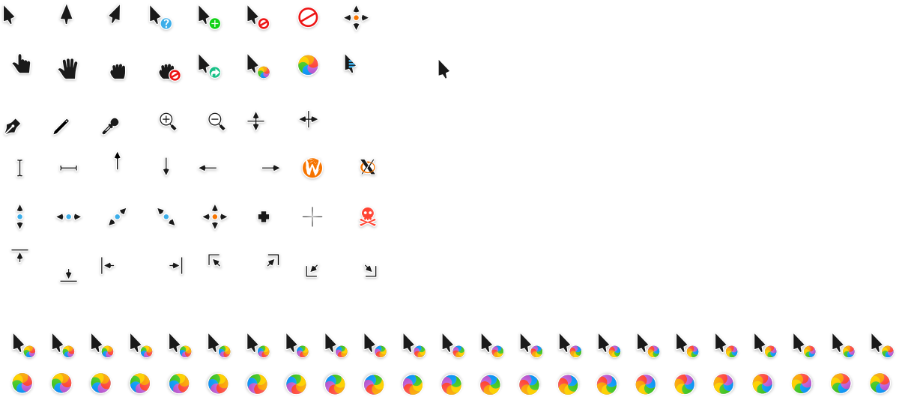

# Capitaine cursors
This is an x-cursor theme inspired by macOS and based on KDE Breeze. It was created with Inkscape and xcursorgen, and was designed to pair well with my icon pack, [La Capitaine](https://github.com/keeferrourke/la-capitaine-icon-theme).

Everything you need to build the xcursor theme is found in `src/`, and the prebuilt theme is found in `bin/xcursor/`

There is also a Windows cursor theme available in `bin/windows/`, though it is not buildable from source. It also will not receive substantial updates.

## License
Capitaine cursors is based on KDE Breeze cursors, as such it falls under the same license.
Capitaine cursors is LGPLv3. See COPYING for more details.

## Notes
The PNGs files were exported directly from the SVG sources in the Inkscape GUI when I initially made this cursor theme -- I plan to modify the build script such that only the SVG source will be required to build in the next release.

## Installation
### \*NIXes, \*BSDs, and possibly others
To install the cursor theme simply copy the compiled theme to your icons directory. For local user installation:

    cp -pr bin/xcursor ~/.icons/capitaine-cursors

For system-wide installation for all users:

    sudo cp -pr bin/xcursor /usr/share/icons/capitaine-cursors
    sudo chmod -R 644 /usr/share/icons/capitaine-cursors

Then set the theme with your preferred desktop tools.

### Windows
The Windows build comes with an INF file to make installation easy. Open `bin/windows` in Explorer, and right click on `install.inf`. Click 'Install' from the context menu, and authorise the modifications to your system. Then open Control Panel > Personalisation and Appearance > Change mouse pointers, and select Capitaine cursors. Click 'Apply'.

## Building from source
You'll find everything you need to build and modify this cursor set in the `src/` directory. To build the xcursor set from the PNG source run:

    ./build.sh

to generate the pixmaps and appropriate aliases. The freshly compiled cursor theme will be located in `src/build/`

## Preview

